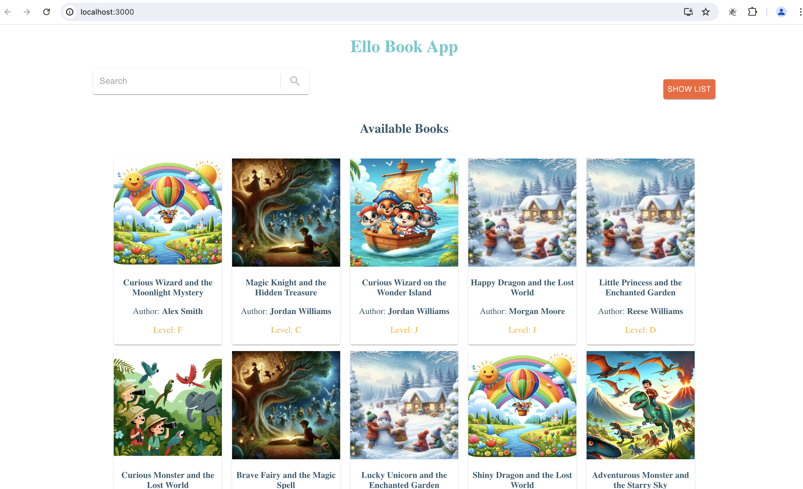
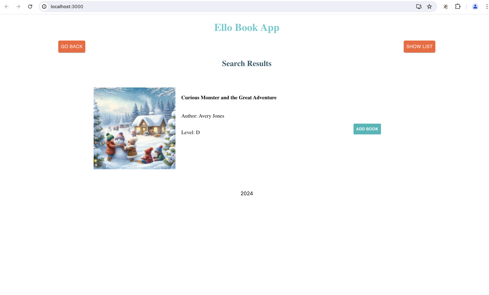
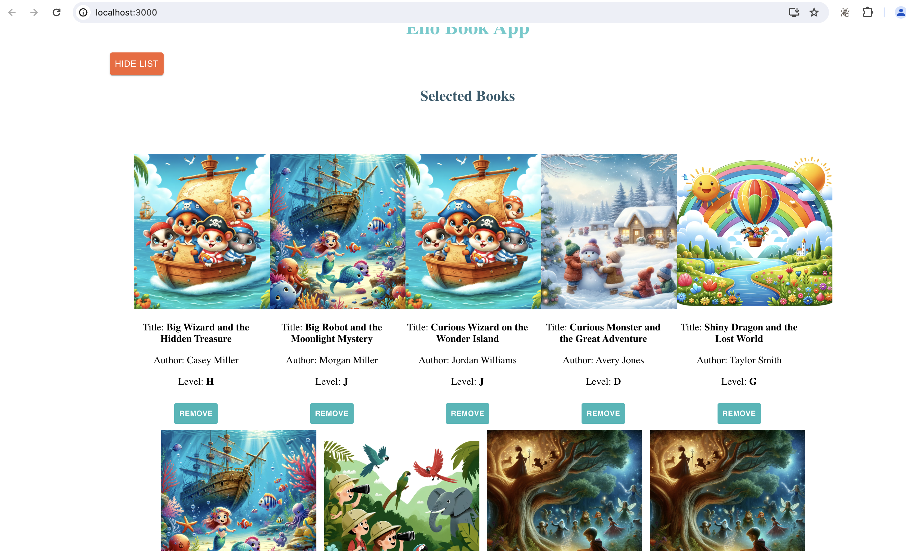

# fullstack-frontend

### Data
To get access to data that you will use for this, navigate over to this repo `https://github.com/njugunanduati/fullstack-backend` and get the latest version. One you get it set-up and started, it will be running on `http://localhost:4000/`


### How it works
Once you have started the backed server, you can now run the following commands to start the front end application.
```bash
npm install
```

Then run the following command to start the server

```bash
npm start
```

This ui will be running on the url `http://localhost:3000/`
#### Available Books


#### Search Result


#### Selected Book List

